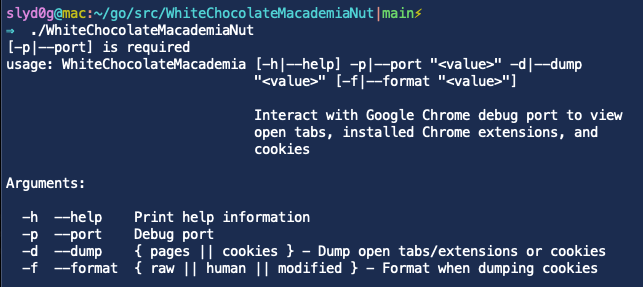

# WhiteChocolateMacademiaNut



## Description
Interacts with [Chromium's debug port](https://blog.chromium.org/2011/05/remote-debugging-with-chrome-developer.html) to view open tabs, installed extensions, and cookies. Can be used against Google Chrome and Microsoft Edge.

## Usage
- Dump the user's open tabs and installed extensions
    - ```./WhiteChocolateMacademiaNut -p 4200 -d pages```
- Dump the user's cookies in human-readable format
    - ```./WhiteChocolateMacademiaNut --port 1337 --dump cookies --format human```
- Dump the user's cookies in raw JSON as returned by Chromium
    - ```./WhiteChocolateMacademiaNut --port 1234 --dump cookies --format raw```
- Dump the user's cookies in JSON with the name, value, domain, path, and modified expirationDate attribute to 10 years in the future (compatible with [Cookiebro extension](https://nodetics.com/cookiebro/))
    - ```./WhiteChocolateMacademiaNut -p 666 -d cookies -f modified```

## References
- https://mango.pdf.zone/stealing-chrome-cookies-without-a-password
- https://github.com/defaultnamehere/cookie_crimes